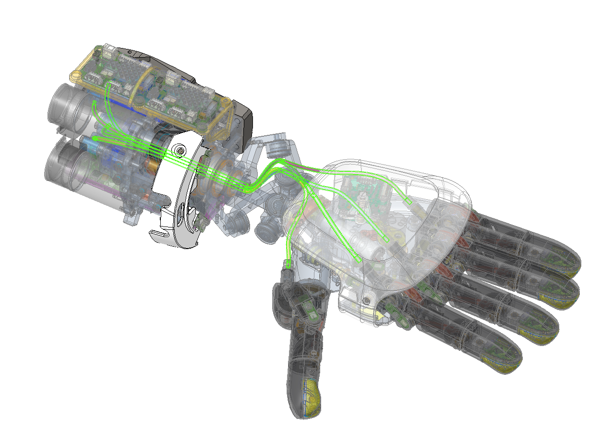
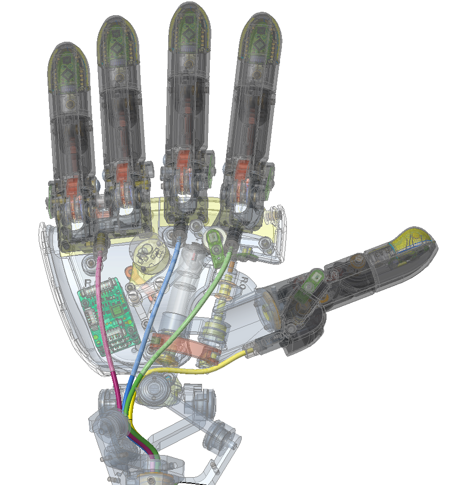
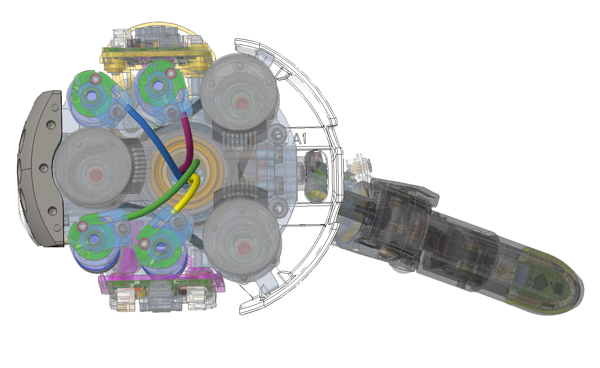
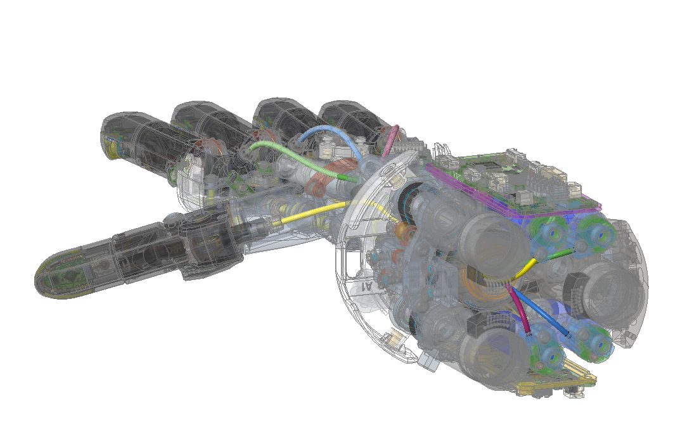

# Snapshot of ergocub S/N 000 
**Mechanical Snapshot**
- Mechanics without body shell.    (_Updates in progress_)

**NOTE :**

- **Neck**
 
 Added washers in the neck joint 
 
 | Item / IITCODE | Quantity |  Description | Notes  |
|:---:|:---:|:---|:---|
| 6287 | 1pz | NECK SPACER (int. diameter 26 mm) |  |
| 1874 | 4pz | Washer - flat regular type - M2.5 (2.7x6x0.5) - SS A2 140HV - DIN125 A, ISO7089, UNI 6592 |

- **Lower body**:

On Part ECUB_003_P_137 part no. 16112, a modification was made to the internal diameter to allow coupling with the following parts:

| Item / IITCODE | Alias |
|:---:|:---:|
|16110  | ECUB_003_P_070 |  
| 16101 | ECUB_003_P_030 |  
| 16111 | ECUB_003_P_134 | 

Hip cable covers have been added

| Item / IITCODE | Alias |
|:---:|:---:|
|17006  | ECUB_003_P_146 |
|17007  | ECUB_003_P_147 |

- **Hands**:

The following table details the sheats and tendons code. The precise length is defined during the assembling of the hand.

| Component | Alias | WINGST code | Lenght |
| ---- | ---- | ---- | ---- | 
| Thumb sheath | MOLL-AST_1356-0_35-2_0-800_0 | 16584 | 190 [mm] +- 10% |
| Other fingers sheath | MOLL-AST_1356-0_35-2_0-800_0 | 16584 | 200 [mm] +- 10% |
| Tendons | CG077081 | 4482 | 350 [mm] |

The following images detail the routing of the tendons.

- Left hand

- Right hand

